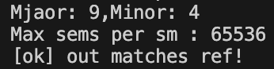

## MI300X CDNA3 Instructrion

#### test_v_mfma_f32_16x16x32_fp8_fp8

This file demonstrate basic usage of AMD fp8 data type and **__builtin_amdgcn_mfma_f32_16x16x32_fp8_fp** and ASM instruction **v_mfma_f32_16x16x32_fp8_fp8**.

It supports single warp (64 threads, 1-4-1) , multi-blocks v_mfma execution.

#### How to use

- Compilation :

    ```
    hipcc test_v_mfma_f32_16x16x32_fp8_fp8.cc -o test_v_mfma_fp8
    ```

- Execution : 

Successful exection should exepct :



- Inspect ASM : 

    ```
    hipcc -S test_v_mfma_f32_16x16x32_fp8_fp8.cc -save-temps -o test_v_mfma_fp8.S
    ```

